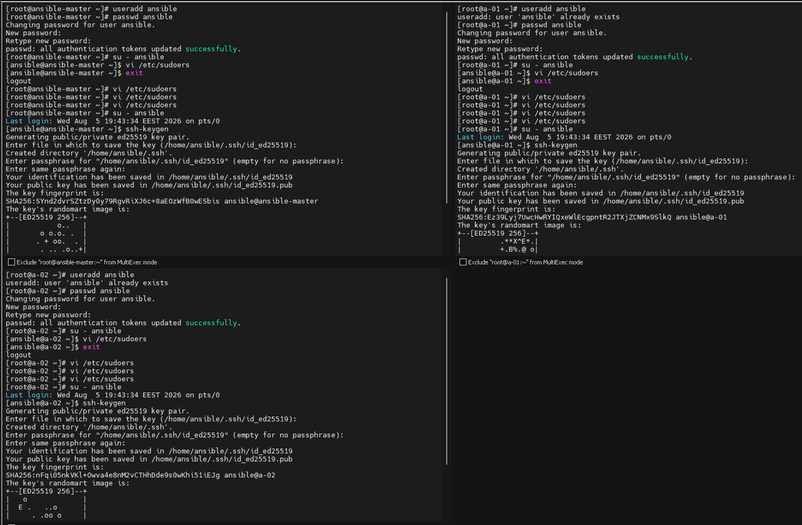

# Ansible Passwordless Multi-Node Automation

Configuring an Ansible Control Node (Master) to manage two Managed Nodes (Workers) without passwords, using SSH key-based authentication and a custom inventory file — a DEPI DevOps Track task.

---

## 📋 Scenario

- **1 Ansible Control Node (Master)** — 1GB RAM, 1 CPU
- **2 Managed Nodes (Workers)** — 1GB RAM, 1 CPU each

**Goal:** Configure the environment so the Master can manage both Workers using Ansible without passwords.

---

## ✅ Requirements

**On All Nodes**
1. Create a user named `ansible`
2. Set a password for the user
3. Configure sudo privileges for the user
4. Verify the user can execute commands using `sudo`

**On the Master Node**
1. Install Ansible using `pip`
2. Generate an SSH key pair for the `ansible` user
3. Verify the key pair was created successfully

**Configure Passwordless Authentication**
1. Copy the public key from the Master to both Workers using `ssh-copy-id`
2. Verify SSH from the Master to each Worker works without a password

**Inventory Configuration**
1. Create an inventory file containing both workers, named `inventory`

---

## 🔧 Setup Steps

### 1. Create the `ansible` user and configure sudo (run on all nodes)

```bash
useradd ansible
passwd ansible
su - ansible
```

Then edit the sudoers file:

```bash
visudo
```

Add the following line to grant passwordless sudo:

```
ansible ALL=(ALL)       NOPASSWD: ALL
```

Generate the SSH key pair as the `ansible` user on the master and each worker:

```bash
ssh-keygen -t ed25519
```



### 2. Verify the sudoers entry

Confirming the `ansible ALL=(ALL) NOPASSWD: ALL` line landed correctly in `/etc/sudoers` on the master and both workers:


### 3. Copy the public key to both Workers and verify passwordless SSH

```bash
ssh-copy-id ansible@<WORKER_1_IP>
ssh-copy-id ansible@<WORKER_2_IP>

# verify
ssh ansible@<WORKER_1_IP>
exit
ssh ansible@<WORKER_2_IP>
exit
```


### 4. Confirm the public key landed in `authorized_keys` on both Workers

```bash
cd ~/.ssh
ls
cat authorized_keys
```


### 5. Create the inventory file on the Master

```bash
mkdir -p ~/ansible
cd ~/ansible
vi inventory
```

See [`inventory`](./inventory) for the file contents.

---

## ✅ Validation

Run:

```bash
ansible all -i inventory -m ping
```

**Expected result:**

```
worker-01 | SUCCESS => {
    "ansible_facts": {
        "discovered_interpreter_python": "/usr/bin/python3"
    },
    "changed": false,
    "ping": "pong"
}
worker-02 | SUCCESS => {
    "ansible_facts": {
        "discovered_interpreter_python": "/usr/bin/python3"
    },
    "changed": false,
    "ping": "pong"
}
```

This confirms the Master can reach and authenticate with both Workers over SSH without a password, and that Ansible can successfully execute modules against them.


---

## 📂 Repository Structure

```
.
├── README.md
├── inventory
└── images/
    ├── 01-user-sudo-ssh-keygen.jpg
    ├── 02-sudoers-config.jpg
    ├── 03-authorized-keys-workers.jpg
    ├── 04-ssh-copy-id-and-passwordless-verify.jpg
    └── 05-inventory-and-ping-validation.jpg
```

---

## 🛠️ Tools & Technologies

- Ansible (installed via `pip`)
- SSH key-based authentication (`ed25519`)
- Linux user & sudo management

---

## 📝 Notes

- The `ansible` user was created with a password on every node (Master and both Workers) to satisfy the sudo/user requirements, but day-to-day access from the Master to the Workers relies entirely on the SSH key pair — no password is ever entered during that connection.
- The first `ssh-copy-id` attempt to worker-02 hit a few `Permission denied` retries before succeeding — a common hiccup when the target's SSH service hasn't fully settled or the password is mistyped; retrying with the correct password resolved it.
- IP addresses in this write-up (`192.168.148.130`, `192.168.148.134`) come directly from the lab environment; replace them with your actual worker IPs when reproducing the setup.
